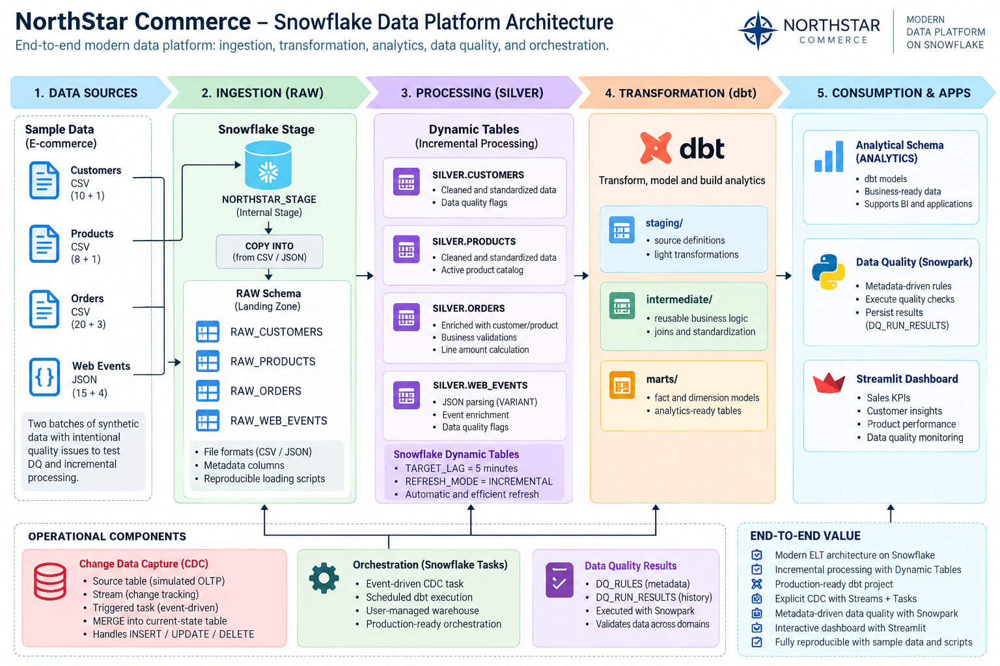

# NorthStar Commerce: End-to-End Snowflake Data Platform

An end-to-end cloud data engineering portfolio project built with **Snowflake, dbt, Snowpark Python, Dynamic Tables, Streams, Tasks, and GitHub**.

NorthStar Commerce simulates a modern e-commerce data platform that ingests structured and semi-structured data, processes incremental changes, applies metadata-driven Data Quality controls, implements Change Data Capture, and publishes analytics-ready dimensional models.

> Built entirely in the Snowflake cloud environment using Snowsight Workspaces.

---

## Architecture



The platform follows a layered ELT architecture:

```text
CSV / JSON
    ↓
Snowflake Internal Stage
    ↓
COPY INTO
    ↓
RAW
    ↓
Dynamic Tables
    ↓
SILVER
    ↓
dbt
    ↓
STAGING / INTERMEDIATE
    ↓
GOLD
    ↓
Analytics
```

Additional platform capabilities include:

- Change Data Capture with Snowflake Streams
- Event-driven processing with triggered Tasks
- Scheduled dbt production execution
- Metadata-driven Data Quality with Snowpark Python
- DEV / PROD environment separation
- Git-based source control
- Reproducible synthetic datasets

For the full technical design, see:

[`docs/architecture/architecture.md`](docs/architecture/architecture.md)

---

## Project Highlights

### Snowflake-Native ELT

The project uses Snowflake internal stages and `COPY INTO` to ingest:

- Customer data
- Product data
- Order transactions
- JSON web events

Source-file metadata is also captured for ingestion traceability.

---

### Incremental Processing with Dynamic Tables

The SILVER layer is implemented with Snowflake Dynamic Tables using:

```sql
TARGET_LAG = '5 minutes'
REFRESH_MODE = INCREMENTAL
```

Dynamic Tables perform:

- Data cleansing and standardization
- JSON / VARIANT parsing
- Referential validation
- Business-rule validation
- Derived metric calculations
- Data Quality flag generation

---

### Explicit Change Data Capture

A separate CDC pipeline demonstrates change tracking using:

```text
Source Table
    ↓
Snowflake Stream
    ↓
Triggered Task
    ↓
MERGE
    ↓
Current-State Table
```

The implementation handles:

- INSERT
- UPDATE
- DELETE

using Snowflake stream metadata including:

```text
METADATA$ACTION
METADATA$ISUPDATE
```

---

### Metadata-Driven Data Quality with Snowpark

Data Quality rules are stored as metadata in:

```text
NORTHSTAR_DB.CONTROL.DQ_RULES
```

A reusable Snowpark Python engine dynamically executes enabled rules and persists historical results to:

```text
NORTHSTAR_DB.CONTROL.DQ_RUN_RESULTS
```

Examples include:

- Invalid customer references
- Invalid quantities
- Invalid prices
- Missing identifiers
- Missing customer emails
- Invalid customer statuses
- Incomplete web events

New checks can be introduced through metadata without changing the core Python execution engine.

---

### dbt Analytics Engineering

dbt transforms SILVER data through three logical layers.

```text
staging/
    stg_customers
    stg_products
    stg_orders
    stg_web_events

intermediate/
    int_valid_orders

marts/
    dim_customer
    dim_product
    fact_orders
    mart_sales_daily
    mart_customer_360
```

The project uses dbt tests including:

- `unique`
- `not_null`
- `accepted_values`
- `relationships`

Known upstream Data Quality anomalies can remain visible as warnings while certified downstream models enforce stricter validation.

---

## DEV → PROD Architecture

Development models are isolated in:

```text
NORTHSTAR_DB.DBT_DEV
```

Production transformation models are deployed to:

```text
NORTHSTAR_DB.DBT_TRANSFORM
```

Analytics-ready production models are deployed to:

```text
NORTHSTAR_DB.GOLD
```

A custom dbt `generate_schema_name` macro controls schema routing between environments.

The dbt code is also deployed as a native Snowflake object:

```text
NORTHSTAR_DB.CONTROL.NORTHSTAR_DBT_PROJECT
```

and can be orchestrated using Snowflake Tasks.

---

## Validated Results

The project was executed and validated end-to-end using two incremental data batches.

| Metric | Result |
|---|---:|
| RAW Customers | 11 |
| RAW Products | 9 |
| RAW Orders | 23 |
| RAW Web Events | 19 |
| Valid Fact Orders | 21 |
| Intentionally Invalid Orders | 2 |
| Completed Orders | 17 |
| Units Sold | 23 |
| Gross Revenue | 2,709.77 |
| Average Order Value | 159.40 |

The two intentionally invalid orders demonstrate the quality-control workflow:

```text
ORDER 5016 → references a non-existent customer
ORDER 5017 → quantity = 0
```

These records remain observable upstream but are prevented from reaching the certified `FACT_ORDERS` model.

---

## Analytics Models

### `MART_SALES_DAILY`

Provides daily commercial metrics including:

- Total orders
- Unique customers
- Units sold
- Gross revenue
- Average order value

### `MART_CUSTOMER_360`

Combines customer, transactional, and behavioral data including:

- Total and completed orders
- Lifetime revenue
- Last order date
- Web-event activity
- Product views
- Add-to-cart events
- Purchase events
- Last event timestamp

---

## Repository Structure

```text
northstar-snowflake-data-platform/
│
├── README.md
│
├── sample_data/
│   ├── customers.csv
│   ├── products.csv
│   ├── orders.csv
│   ├── web_events.json
│   └── incremental batch files
│
├── snowflake/
│   ├── 01_setup/
│   ├── 02_ingestion/
│   ├── 03_dynamic_tables/
│   ├── 04_cdc/
│   └── 05_orchestration/
│
├── snowpark/
│   └── data_quality/
│
├── dbt/
│   ├── models/
│   │   ├── staging/
│   │   ├── intermediate/
│   │   └── marts/
│   └── macros/
│
├── streamlit/
│   └── northstar_dashboard/
│       ├── streamlit_app.py
│       ├── snowflake.yml
│       ├── pyproject.toml
│       └── .streamlit/
│           └── config.toml
└── docs/
    └── architecture/
        ├── architecture.md
        └── architecture.png
```

---

## Technology Stack

| Area | Technology |
|---|---|
| Cloud Data Platform | Snowflake |
| Transformation | SQL, dbt |
| Python Processing | Snowpark Python |
| Incremental ELT | Snowflake Dynamic Tables |
| Semi-Structured Data | JSON, VARIANT |
| CDC | Snowflake Streams |
| Orchestration | Snowflake Tasks |
| Data Quality | Snowpark + dbt tests |
| Data Modeling | Dimensional Modeling |
| Version Control | Git / GitHub |
| Development Environment | Snowflake Workspaces |

---

## Reproducing the Project

### 1. Create the Snowflake environment

Run:

```text
snowflake/01_setup/environment.sql
```

### 2. Create file formats and internal stage

Run:

```text
snowflake/02_ingestion/file_formats_and_stage.sql
```

### 3. Create RAW tables

Run:

```text
snowflake/02_ingestion/raw_tables.sql
```

### 4. Upload the sample datasets

Upload the contents of:

```text
sample_data/
```

to:

```text
@NORTHSTAR_DB.RAW.NORTHSTAR_STAGE
```

### 5. Load RAW data

Run:

```text
snowflake/02_ingestion/load_raw_data.sql
```

### 6. Build the SILVER layer

Run:

```text
snowflake/03_dynamic_tables/silver_layer.sql
```

### 7. Configure Data Quality

Run:

```text
snowpark/data_quality/dq_framework_setup.sql
```

Then execute:

```text
snowpark/data_quality/dq_engine.py
```

inside a Snowflake Python / Snowpark environment.

### 8. Build the dbt models

From the Snowflake dbt Workspace:

```bash
dbt build --target dev
```

For production:

```bash
dbt build --target prod
```

### 9. Optional CDC pipeline

Run:

```text
snowflake/04_cdc/customer_cdc.sql
```

The triggered CDC Task is left suspended by default.

### 10. Optional production orchestration

Run:

```text
snowflake/05_orchestration/dbt_orchestration.sql
```

The scheduled production Task is also left suspended by default to avoid unnecessary compute consumption.

---

## Engineering Decisions

NorthStar intentionally keeps invalid records visible in upstream layers rather than silently deleting them.

This makes it possible to separate:

```text
Data observability
       ↓
Data validation
       ↓
Certified analytical consumption
```

The platform therefore demonstrates both **data engineering** and **analytics engineering** concerns:

- Ingestion
- Incremental processing
- Semi-structured data
- CDC
- Data Quality
- Transformation
- Testing
- Dimensional modeling
- Environment management
- Deployment
- Orchestration

---

## Current Status

Core data platform: **Complete ✅**

```text
✅ Environment provisioning
✅ CSV / JSON ingestion
✅ RAW layer
✅ Dynamic Tables
✅ SILVER layer
✅ Incremental processing
✅ CDC with Streams
✅ Triggered Tasks
✅ Metadata-driven Data Quality
✅ Snowpark Python
✅ dbt staging models
✅ dbt intermediate models
✅ Dimensional modeling
✅ Analytics marts
✅ dbt testing
✅ DEV / PROD separation
✅ Native dbt deployment
✅ Scheduled orchestration
✅ GitHub integration
✅ Reproducible sample data
✅ Architecture documentation
✅ Streamlit analytics application
✅ Streamlit deployment in Snowflake
```

---

## Streamlit Analytics Application

A Streamlit in Snowflake application provides the interactive consumption layer for the platform.

The deployed application is:

```text
NORTHSTAR_DB.APPS.NORTHSTAR_COMMERCE
```

The dashboard reads directly from certified `GOLD` analytics models and Data Quality results stored in `CONTROL`.

It contains four analytical views:

- **Sales Overview** — completed orders, units sold, gross revenue, average order value, revenue trends, and daily order activity
- **Customer 360** — customer revenue, transactional activity, and behavioral web-event metrics
- **Product Performance** — product-level orders, units sold, revenue, and average order value
- **Data Quality Monitoring** — latest metadata-driven DQ execution results, failed rules, severity, and affected rows

The application is deployed natively in Snowflake using:

```text
Query warehouse: NORTHSTAR_WH
Compute pool: SYSTEM_COMPUTE_POOL_CPU
Schema: NORTHSTAR_DB.APPS
```

---

## About This Project

NorthStar Commerce is a portfolio-scale implementation designed to demonstrate production-oriented Data Engineering patterns without hiding the underlying architecture behind managed abstractions.

The focus is not dataset size, but **end-to-end engineering design, reproducibility, incremental processing, Data Quality, orchestration, and maintainability**.
